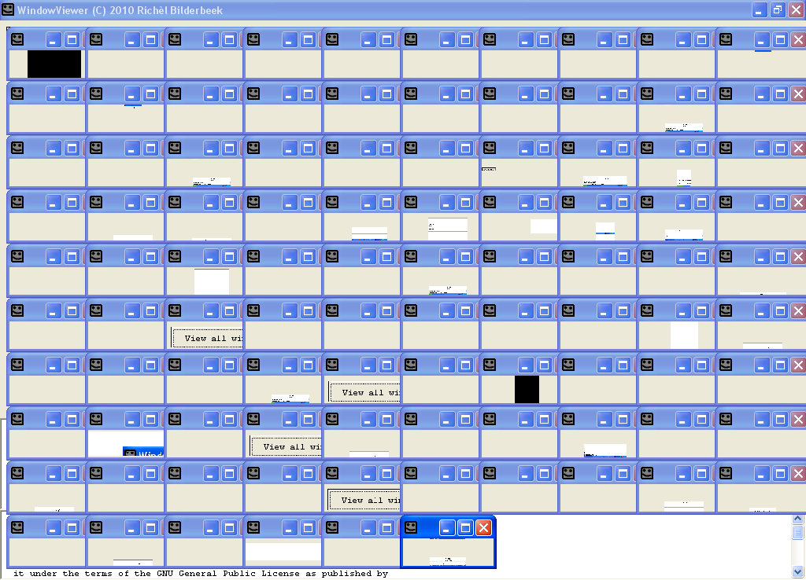

# WindowViewer

WindowViewer is a failed attempt to capture all
Windows windows as bitmaps.
 
[WindowViewer](https://github/com/richelbilderbeek/WindowViewer.htm) was released on the 6th of February
of 2010 and programmed in C++](https://github.com/richelbilderbeek/cpp) using the
[IDE](https://github.com/richelbilderbeek/cpp/blob/master/content/CppIde.md)
[C++
Builder](https://github.com/richelbilderbeek/cpp/blob/master/content/CppBuilder.md)
6.0. It uses the
[STL](https://github.com/richelbilderbeek/cpp/blob/master/content/CppStl.md),
[Boost](https://github.com/richelbilderbeek/cpp/blob/master/content/CppBoost.md)
and [VCL](https://github.com/richelbilderbeek/cpp/blob/master/content/CppVcl.md)
[libraries](https://github.com/richelbilderbeek/cpp/blob/master/content/CppLibrary.md).

 * [Download the 'WindowViewer' Windows executable (version 1.0)(zip)](ToolWindowViewerExe.zip)


 
## Why did it fail?

I attempted to use WindowViewer to view all the
hidden windows the Windows Task Manager makes you aware of.
WindowViewer does not show those: at the
location of where this hidden window is, it obtains the bitmap of what
is visible there.

## Core code

```c++
//std::vector<boost::shared_ptr<TFormImage> > m_v
//TFormImage has one member, a TImage called Image
 
HWND handle = GetWindow(GetForegroundWindow(),GW_HWNDFIRST);
int index = 0;
 
while(handle)
{
  const int sz = 256;
  char buffer[sz];
  GetWindowText(handle,buffer,sz);
  const std::string text(buffer);
  if (text.empty())
  {
    handle = GetNextWindow(handle,GW_HWNDNEXT);
    continue;
  }
 
  if (index == static_cast<int>(m_v.size()))
  {
    boost::shared_ptr<TFormImage> i(new TFormImage(0));
    i->Image->Picture->Bitmap->PixelFormat = pf32bit;
    i->Caption = "";
    m_v.push_back(i);
  }
 
  RECT rect;
  GetWindowRect(handle,&rect);
  const int width = rect.right - rect.left;
  const int height = rect.bottom - rect.top;
 
  Graphics::TBitmap * b = m_v[index]->Image->Picture->Bitmap;
  assert(b);
  assert (b->PixelFormat == pf32bit);
 
  HDC dc = GetDC(handle);
  if (!dc)
  {
    handle = GetNextWindow(handle,GW_HWNDNEXT);
    continue;
  }
 
  m_v[index]->ClientWidth = width;
  m_v[index]->ClientHeight = height;
  b->Width = width;
  b->Height = height;
 
  BitBlt(b->Canvas->Handle, 0, 0, b->Width, b->Height, dc, 0, 0, SRCCOPY);
  b->Modified = true;
 
  ReleaseDC(handle,dc);
  handle = GetNextWindow(handle,GW_HWNDNEXT);
  ++index;
}
```
